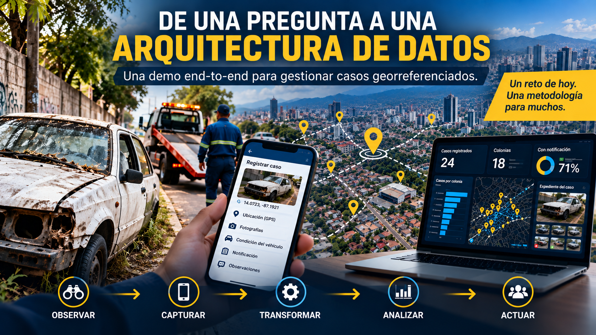
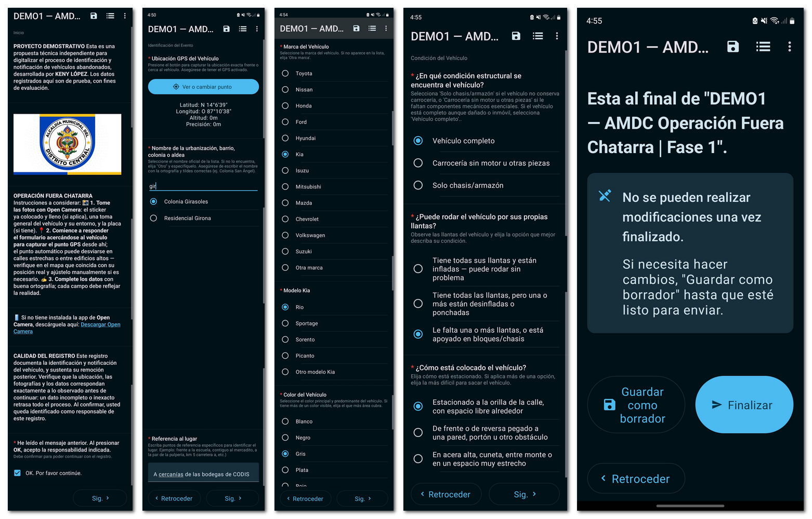
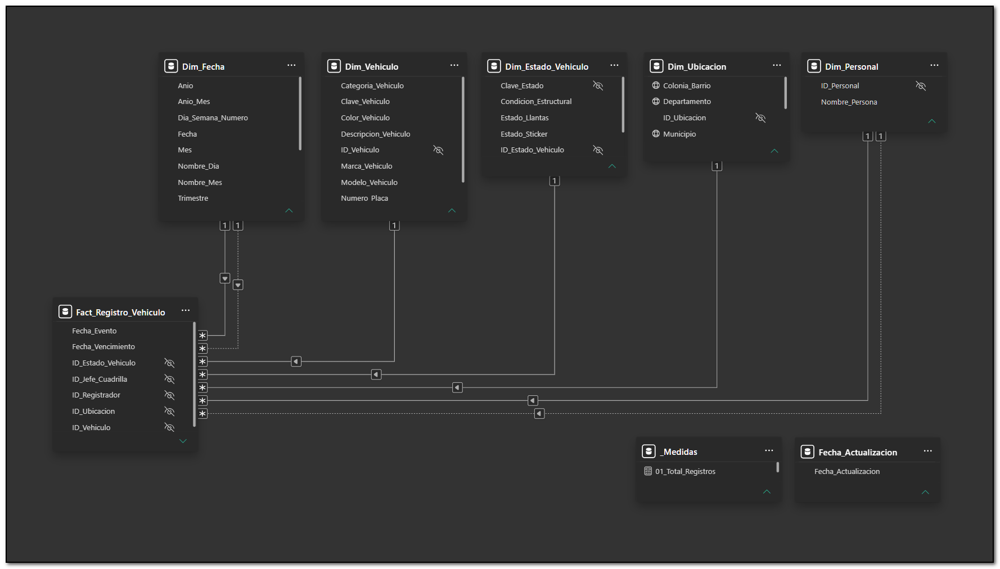
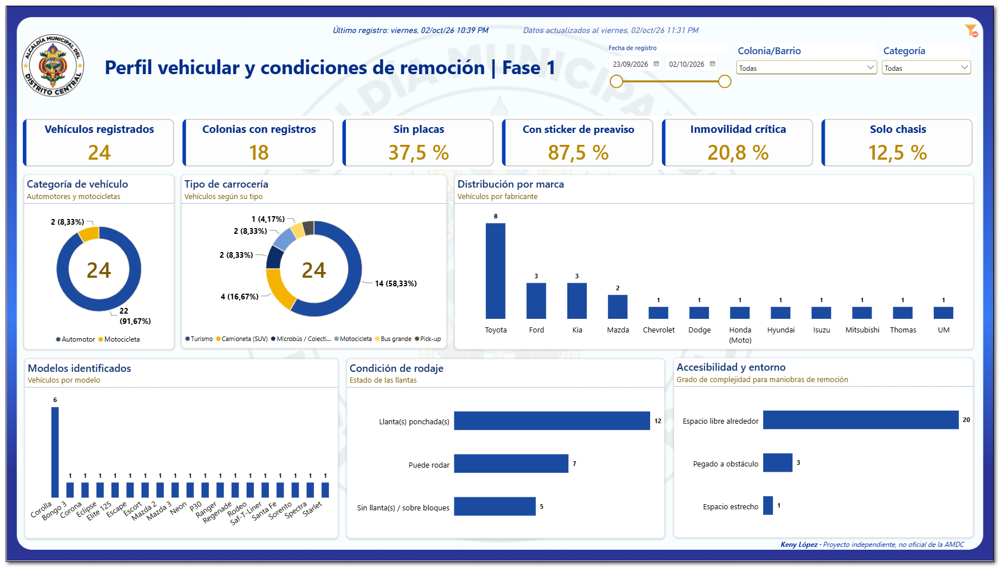
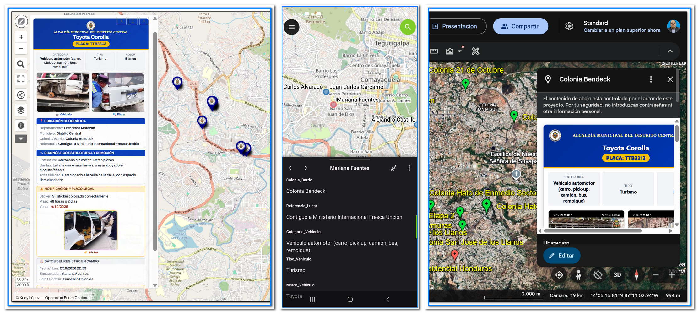
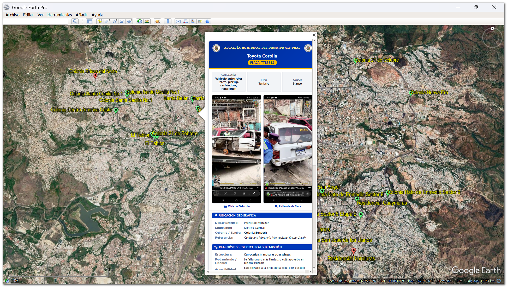
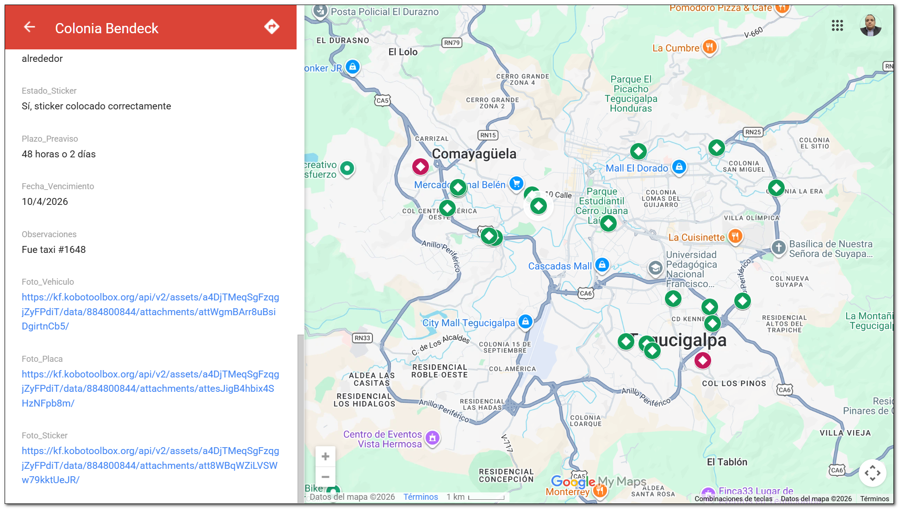
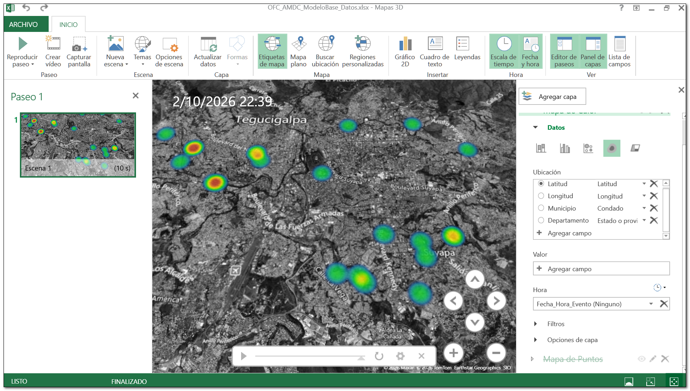

# De una pregunta a una arquitectura de datos: una demo end-to-end para gestionar casos georreferenciados

> **Demo independiente y no oficial.** El caso de uso se inspira en la Operación Fuera Chatarra de la Alcaldía Municipal del Distrito Central (AMDC). No fue desarrollado por encargo de la AMDC, no utiliza información interna de la institución y no pretende describir, sustituir ni evaluar sus sistemas. Todos los datos son de prueba.

**English summary.** An end-to-end demo of a georeferenced case-management workflow: structured field capture with GPS and photos (offline-first), a dimensional model and dashboard in Power BI, and map products for different users (Google Earth, uMap, My Maps, QField). Built with free tools and test data only. Independent portfolio project, not an official project of any institution.

---

## Explora la demo

| Producto | Qué puedes hacer | Enlace |
|---|---|---|
| Dashboard en Power BI | Filtrar por fecha, colonia y categoría; explorar vehículos, condiciones de remoción y evidencia | [Abrir dashboard](https://app.powerbi.com/view?r=eyJrIjoiNTE2NjdjZDAtYmFmOC00MDc5LTk4NjgtM2VmMTYxNGJjZWQzIiwidCI6IjY4ODYzYjAyLTkxMDYtNDU2Yi1iYzFiLTEyNzRkMGZiZGJjYiIsImMiOjZ9) |
| Mapa en Google Earth Web | Explorar los registros en su contexto territorial, con la ficha de cada caso | [Abrir mapa](https://earth.google.com/earth/d/1iwjQfTcOWLD_yuXroj5fZIQc-_-XBPuI?usp=sharing) |
| Video del formulario | Ver el recorrido de un registro en KoboCollect | [Ver video](https://drive.google.com/file/d/1p0gcpqKXltXdgJiM3MM62O82WJ2KYA9p/view?usp=sharing) |
| Artículo en LinkedIn | La historia del proyecto y sus aprendizajes | [Leer artículo](URL-DEL-ARTICULO) |

> El dashboard se publicó con una licencia de prueba de Power BI que ya venció, por lo que ese enlace podría dejar de estar disponible. Las capturas de este README muestran todo el proyecto.

---

## El problema y la idea

Todo empezó observando las publicaciones de la AMDC sobre la Operación Fuera Chatarra y haciéndome una pregunta: *¿cómo estarán registrando todo esto?* No conozco los sistemas internos de la institución; justamente por eso la pregunta me pareció un buen ejercicio.

Convertí las preguntas en variables, las variables en un instrumento de captura y los datos estructurados en productos para distintos usuarios. La idea central es **capturar una vez y reutilizar muchas veces**: una coordenada registrada en campo no debería volver a digitarse para ponerla en un mapa, ni una fecha para controlar un plazo.

Una distinción guió el diseño: **el vehículo es el objeto observado; el caso es el objeto gestionado.** Esta primera fase cubre la captura y el registro del caso, incluida su notificación. El seguimiento y la resolución quedan para una siguiente fase.

---

## Arquitectura

La lógica **observar → capturar → transformar → analizar → actuar** no depende del tipo de caso. Podría adaptarse a inspecciones, incidencias viales, activos o intervenciones ambientales; cambiarían las preguntas, las variables y las reglas, no el recorrido del dato.

| Capa | Qué hace |
|---|---|
| Captura | KoboToolbox y KoboCollect (también probado con ODK Collect) |
| Persistencia y acceso | Servidor de KoboToolbox y acceso por API |
| Integración, ETL y modelado | Power Query (Excel y Power BI) y un pipeline reproducible en Python, con rutas reconciliadas entre sí; el dashboard publicado consume los datos mediante Power Query |
| Consumo y distribución | Power BI, Excel, Google Earth, uMap, My Maps, QField, y formatos CSV, XLSX, GeoJSON y KMZ |
| Usuarios | Supervisión, análisis y personal de campo |

---

## Captura en campo

- Cerca de 50 preguntas con listas controladas y lógica condicional: una respuesta determina qué se pregunta después.
- Coordenada GPS del vehículo y tres fotografías: vehículo y entorno, placa y sticker de preaviso.
- Captura sin conexión (offline-first) con KoboCollect: el registro y su coordenada se guardan en el dispositivo y se sincronizan cuando vuelve la conexión.
- Reduce la digitación libre, pero no la elimina: el error humano al describir algo en campo sigue existiendo. En la demo los nombres del personal se escriben a mano; con códigos de empleado ese riesgo bajaría bastante.

---

## Modelo dimensional

Un hecho (el registro del vehículo) y cinco dimensiones: **Fecha, Vehículo, Estado del vehículo, Ubicación y Personal.** Dos dimensiones cumplen doble rol: la fecha (del evento y de vencimiento del plazo) y el personal (quien registra y jefe de cuadrilla). El modelo está diseñado para detener la actualización si pierde su integridad, por ejemplo si el hecho llegara a duplicar registros.

Incluye 28 medidas organizadas en familias:

| Familia | Qué responde |
|---|---|
| Volumen | Registros, vehículos únicos y ubicaciones únicas |
| Identificación | Vehículos sin placa y su proporción |
| Condición para la remoción | Vehículos que pueden rodar, inmóviles críticos y solo chasis |
| Notificación | Sticker colocado y su proporción; promedio de días del plazo otorgado |
| Evidencia fotográfica | Proporción de registros con foto del vehículo, de la placa y del sticker |
| Operación y lectura | Registros por jefe de cuadrilla, fecha del último registro, actualización de los datos y fichas de los mapas |

---

## Dashboard

El dashboard no es el sistema; es uno de sus productos. Permite preguntar:

- ¿Cuántos vehículos hay registrados y en cuántas colonias?
- ¿Qué proporción no tiene placa o tiene el sticker de preaviso colocado?
- ¿Qué categorías, tipos de carrocería, marcas y modelos predominan?
- ¿En qué condición de rodaje están y qué tan complejo es el entorno para una maniobra de remoción?

---

## Productos geoespaciales

No todas las decisiones ocurren frente a un dashboard. Una persona en campo puede necesitar solo saber dónde está el caso y consultar su información. Por eso el mismo dato alimenta distintos productos:

  
  
  

| Producto | Uso |
|---|---|
| uMap | Consulta web ligera |
| Google Earth Web y Pro | Exploración territorial con ficha de cada caso |
| Google My Maps | Compartir y explorar casos de forma sencilla |
| QField | Consulta de la información en campo, sin conexión |
| Mapas 3D de Excel | Análisis territorial desde Excel |
| CSV, XLSX, GeoJSON y KMZ | Formatos abiertos para que el dato siga existiendo fuera de cualquier aplicación |

---

## Calidad y validación

Las salidas del pipeline se validan de forma independiente: integridad de los archivos mediante huellas SHA-256, contratos de columnas, unicidad de llaves, integridad referencial, coherencia entre capas y recálculo de los indicadores derivados.

En la corrida validada, de **44 comprobaciones: 42 correctas, 1 aviso, 1 no verificable y 0 fallas.**

El control de calidad también señaló 4 anomalías de captura: registros sin fotografía de la placa o del sticker, que se muestran con una imagen de respaldo, y dos plazos que no coinciden con su fecha de vencimiento. Esas anomalías se corrigen en el formulario, no en el pipeline. Dos reglas de clasificación no fueron ejercitadas por los datos de prueba, así que no están verificadas contra datos reales.

La validación comprueba que las salidas cumplan sus propios contratos; no comprueba que lo capturado en campo sea cierto.

---

## Costo, alcance y límites

- **Costo:** el costo directo de software fue prácticamente cero, con herramientas gratuitas y formatos abiertos. Cero en software no significa cero en trabajo: detrás hay observación, diseño del instrumento, modelado, integración, reglas de negocio, validación y documentación. La salvedad es la licencia de prueba de Power BI mencionada arriba.
- **Alcance:** demuestra la viabilidad técnica y conceptual de integrar captura estructurada, GPS, fotografías, integración, analítica y productos geoespaciales en un mismo flujo.
- **Límites:** no demuestra una implementación institucional. Llevarlo a producción exigiría validar procesos con usuarios reales y resolver seguridad, permisos, gobernanza, privacidad, almacenamiento, escalabilidad, capacitación y soporte.
- **Imágenes:** algunas fotografías de prueba provienen de publicaciones públicas de la AMDC en redes sociales; pertenecen a sus titulares y se usan solo para ilustrar la demo.

---

## Autor

**Keny López** — Data Analyst / BI Specialist · Microsoft Fabric Analytics Engineer (DP-700) · Power BI Data Analyst (PL-300)

[LinkedIn](https://www.linkedin.com/in/kenylopez-data-analyst) · [Portafolio](https://sites.google.com/view/portafolio-keny-lpez/inicio)

© 2026 Keny López. Todos los derechos reservados. Demo con fines de portafolio.
