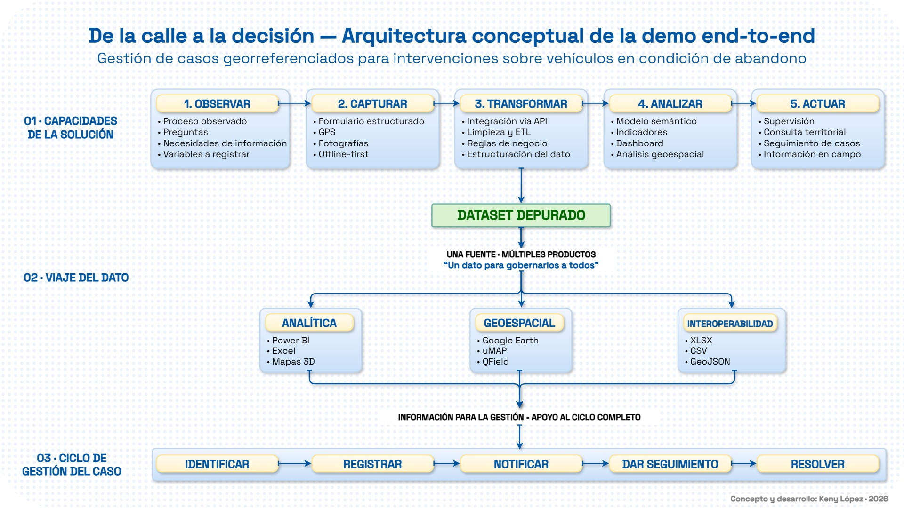
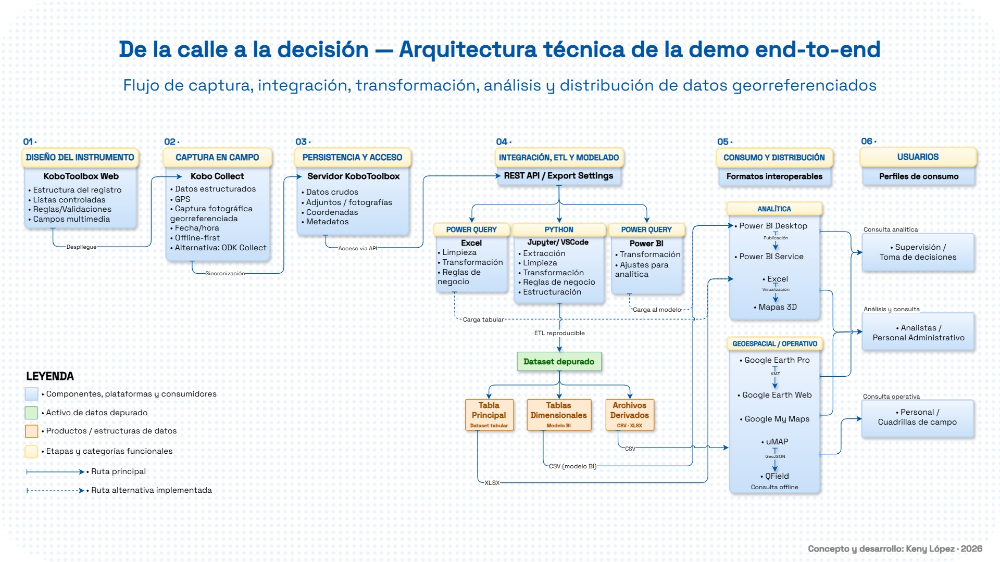
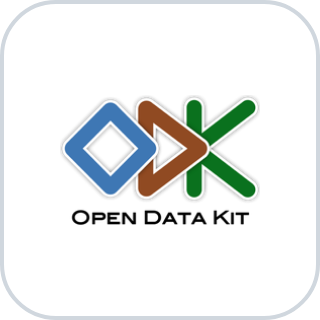

# De una pregunta a una arquitectura de datos

### Una demo end-to-end para gestionar casos georreferenciados

*44 comprobaciones de validación · 28 medidas · 1 tabla de hechos y 5 dimensiones · cerca de 50 campos de captura · 3 fotografías de evidencia*

> **Demo independiente y no oficial.** El caso de uso se inspira en la Operación Fuera Chatarra de la Alcaldía Municipal del Distrito Central (AMDC). No fue desarrollado por encargo de la AMDC, no utiliza información interna de la institución y no pretende describir, sustituir ni evaluar sus sistemas. Todos los datos utilizados son de demostración.

**English summary.** An independent end-to-end demo exploring how structured field capture, georeferenced evidence, data transformation, analytics and mapping can support the management of geographically distributed cases. The project uses abandoned vehicles as a case study, but the underlying architecture is designed to be transferable to other field-based operations.

---

## Explora la demo

| Producto | Qué puedes explorar | Enlace |
|---|---|---|
| Dashboard en Power BI | Indicadores, distribución territorial, características de los vehículos, condiciones y evidencia | [Abrir dashboard](https://app.powerbi.com/view?r=eyJrIjoiNTE2NjdjZDAtYmFmOC00MDc5LTk4NjgtM2VmMTYxNGJjZWQzIiwidCI6IjY4ODYzYjAyLTkxMDYtNDU2Yi1iYzFiLTEyNzRkMGZiZGJjYiIsImMiOjZ9) |
| Google Earth Web | Registros en su contexto territorial y ficha de cada caso | [Abrir mapa](https://earth.google.com/earth/d/1iwjQfTcOWLD_yuXroj5fZIQc-_-XBPuI?usp=sharing) |
| Video del formulario | Recorrido de un registro mediante KoboCollect | [Ver video](https://drive.google.com/file/d/1p0gcpqKXltXdgJiM3MM62O82WJ2KYA9p/view?usp=sharing) |
| Artículo en LinkedIn | Historia, decisiones y aprendizajes detrás del proyecto | [Leer artículo](https://www.linkedin.com/pulse/de-una-pregunta-arquitectura-datos-demo-end-to-end-para-keny-l%C3%B3pez-rzh1e/) |

> **Nota:** el dashboard fue publicado utilizando una licencia de prueba de Power BI. Su disponibilidad pública puede cambiar. Este repositorio conserva evidencia visual de los principales productos desarrollados.

---

## El punto de partida

Todo comenzó observando publicaciones públicas sobre la Operación Fuera Chatarra de la AMDC y haciéndome una pregunta:

> **¿Cómo estarán registrando todo esto?**

No conocía —ni conozco— los sistemas o procedimientos internos utilizados por la institución. Precisamente por eso la pregunta resultaba interesante como ejercicio de diseño.

¿Se registra la ubicación exacta? ¿La placa? ¿El estado físico del vehículo? ¿Fotografías? ¿La condición de rodaje? ¿La notificación? ¿El plazo otorgado?

Una pregunta comenzó a producir otras.

El ejercicio consistió en convertir esas preguntas en variables, las variables en captura estructurada y los datos resultantes en productos útiles para distintos contextos de trabajo.

La idea central fue sencilla:

> **Capturar una vez. Reutilizar muchas veces.**

Una coordenada registrada en campo no debería volver a digitarse para colocar un punto en un mapa. Una fecha no debería capturarse nuevamente para analizar un plazo. La identificación de un caso no debería reconstruirse para crear un dashboard.

---

## Del vehículo al caso

Durante el desarrollo apareció una distinción que terminó definiendo el proyecto:

> **El vehículo es el objeto observado. El caso es el objeto gestionado.**

Registrar un vehículo no equivale necesariamente a gestionar todo su ciclo.

Conceptualmente, un caso puede recorrer etapas como:

**IDENTIFICAR → REGISTRAR → NOTIFICAR → DAR SEGUIMIENTO → RESOLVER**

La demo actual corresponde a una **Fase 1** y llega hasta la notificación. El seguimiento posterior y la resolución representan una posible evolución del sistema y no forman parte de la implementación actual.

---

## Arquitectura conceptual

*De la observación a la acción: cinco capacidades que no dependen del tipo de caso.*

La solución puede resumirse en cinco capacidades:

**OBSERVAR → CAPTURAR → TRANSFORMAR → ANALIZAR → ACTUAR**

El caso de los vehículos abandonados permitió probar esta lógica sobre un problema concreto, pero la arquitectura no depende exclusivamente de ese objeto.

Podría adaptarse a inspecciones, incidencias viales, infraestructura dañada, activos, luminarias o intervenciones ambientales, entre otros escenarios de trabajo territorial.

Cambiarían las preguntas, las variables y las reglas.

**El caso cambia. La arquitectura permanece.**

---

## Arquitectura técnica

*Del instrumento de captura a los productos de consumo y sus usuarios.*

La demo conecta distintas capacidades dentro de un mismo flujo:

| Capa | Tecnologías y propósito |
|---|---|
| Captura | KoboToolbox, KoboCollect y ODK Collect para captura estructurada en campo |
| Persistencia y acceso | KoboToolbox como origen de los registros y evidencia |
| Integración y transformación | Power Query y un pipeline ETL desarrollado en Python |
| Modelado y analítica | Modelo dimensional y dashboard en Power BI |
| Geoespacial | Google Earth, uMap, My Maps, QField y Mapas 3D de Excel |
| Interoperabilidad | Salidas en formatos como CSV, XLSX, GeoJSON y KMZ |

La arquitectura fue diseñada para evitar que cada producto requiera una nueva captura o preparación manual del mismo dato.

---

## Captura en campo

*Formulario en KoboCollect, con rutas condicionadas, ubicación por GPS y evidencia fotográfica.*

El instrumento desarrollado para la demo contiene **cerca de 50 campos y preguntas, incluyendo rutas condicionadas**.

Combina:

- listas controladas y captura estructurada;
- lógica condicional según las respuestas;
- ubicación mediante GPS;
- evidencia fotográfica;
- identificación y condición del vehículo;
- información asociada a la notificación;
- operación offline-first.

La lógica condicional permite que el instrumento adapte las preguntas al caso que se está registrando en lugar de presentar un formulario completamente plano.

La operación offline-first permite realizar la captura aun cuando no exista conectividad permanente y sincronizar posteriormente la información.

El objetivo no era construir un formulario largo.

Era **convertir preguntas en variables y variables en datos estructurados**.

---

## Modelo dimensional

*Una tabla de hechos y cinco dimensiones; fecha y personal pueden desempeñar más de un rol.*

Para el análisis se construyó un modelo dimensional compuesto por una tabla de hechos y cinco dimensiones principales:

**Fecha · Vehículo · Estado del vehículo · Ubicación · Personal**

La fecha y el personal pueden desempeñar más de un rol analítico dentro del modelo, permitiendo observar el mismo registro desde distintas perspectivas.

El modelo incorpora además controles de integridad destinados a detectar inconsistencias que puedan comprometer la estructura esperada de los datos.

Sobre este modelo se desarrollaron **28 medidas** orientadas a responder preguntas sobre:

- volumen de registros y vehículos;
- identificación;
- condición para la remoción;
- notificación;
- evidencia fotográfica;
- operación;
- temporalidad;
- información contextual para mapas y fichas.

El objetivo del modelo no fue acumular métricas, sino convertir los datos capturados en preguntas que pudieran responderse de manera consistente.

---

## Dashboard

*Dashboard publicado en Power BI: indicadores, características de los vehículos, condición y evidencia.*

El dashboard es **uno de los productos del sistema**, no el sistema completo.

Permite explorar preguntas como:

- ¿Cuántos vehículos y ubicaciones han sido registrados?
- ¿Qué proporción de los registros corresponde a vehículos sin placa?
- ¿Qué categorías, tipos, marcas y modelos predominan?
- ¿En qué condición se encuentran?
- ¿Qué evidencia acompaña cada registro?
- ¿Cómo se distribuyen territorialmente los casos?

La información puede filtrarse y explorarse desde diferentes perspectivas sin modificar el dato de origen.

---

## Una fuente, múltiples productos

No todas las decisiones ocurren frente a un dashboard.

Un analista puede necesitar indicadores agregados. Una persona en campo puede necesitar localizar un caso. Otra persona puede requerir revisar evidencia o explorar territorialmente los registros.

Por eso la misma información se utilizó para producir diferentes formas de consumo.

*La misma fuente en uMap, QField y Google Earth.*

  
  
  

*Google Earth Pro, Google My Maps y Mapas 3D de Excel, a partir de los mismos datos.*

| Producto | Uso |
|---|---|
| Power BI | Análisis e indicadores |
| uMap | Consulta web ligera |
| Google Earth Web y Pro | Exploración territorial y fichas de casos |
| Google My Maps | Exploración y distribución sencilla |
| QField | Consulta geoespacial en campo y sin conexión |
| Mapas 3D de Excel | Exploración territorial desde Excel |
| CSV, XLSX, GeoJSON y KMZ | Interoperabilidad entre distintos entornos de consumo |

La intención fue evitar que la información quedara atrapada en una sola aplicación.

---

## Calidad y validación

La demo incluye una etapa de validación independiente de las salidas generadas por el proceso de transformación.

Los controles consideran aspectos como integridad de archivos, estructura esperada, llaves, relaciones, coordenadas, fechas y coherencia de determinados indicadores derivados.

En la corrida documentada de la demo se ejecutaron **44 comprobaciones**:

**42 correctas · 1 aviso · 1 no verificable · 0 fallas**

La validación también permitió identificar anomalías procedentes de la captura de prueba, lo que evidencia una distinción importante:

> **Validar que los datos cumplen un contrato no significa afirmar que todo lo observado en campo sea correcto.**

Los controles técnicos pueden detectar determinadas inconsistencias, pero la calidad final también depende del diseño del instrumento y de la calidad de la captura.

### Documentación de respaldo

La corrida queda respaldada por documentos que se mantienen fuera de este repositorio:

| Documento | Qué registra |
|---|---|
| Acta de validación | Resultado formal de la corrida: comprobaciones ejecutadas, avisos y anomalías detectadas |
| Manifiesto de ejecución | Huella de integridad de las salidas generadas, para comprobar que no cambiaron |
| Cobertura de reglas | Qué reglas de negocio se ejercitaron en la corrida y cuáles no |
| Validación de calidad | Detalle de cada comprobación y su resultado |
| Runbook | Guía operativa y bitácora de decisiones y problemas encontrados |

---

## Innovación frugal

El costo directo de software utilizado para construir la demo fue prácticamente cero.

Se combinaron herramientas gratuitas, capacidades ya disponibles y formatos interoperables para probar una arquitectura funcional sin partir de una inversión tecnológica elevada.

Eso no significa que la solución tenga costo cero.

Detrás existen horas de observación, diseño del instrumento, modelado, integración, reglas, validación, análisis y documentación.

El proyecto es, en ese sentido, un ejercicio de **innovación frugal aplicada a datos**: comenzar por el problema y utilizar los recursos disponibles para comprobar una idea antes de pensar en una implementación de mayor escala.

---

## Alcance y límites

### Lo que este proyecto demuestra

- **Captura estructurada en campo**, con ubicación, evidencia fotográfica y operación sin conexión.
- **Modelado dimensional** con roles de fecha y personal, controles de integridad y 28 medidas.
- **Validación independiente** de las salidas, con resultados y anomalías documentados.
- **Productos para distintos usuarios** a partir de una sola fuente: analítica, mapas y formatos abiertos.
- **Una arquitectura reutilizable** para otros escenarios de trabajo territorial.

### Lo que no pretende ser

Esta demo demuestra la **viabilidad técnica y conceptual** de conectar captura estructurada en campo, georreferenciación, evidencia, transformación, modelado, analítica y productos geoespaciales.

No demuestra una implementación institucional en producción.

Una solución de ese tipo requeriría, entre otros aspectos, validar los procesos con usuarios reales y definir políticas de seguridad, permisos, privacidad, gobernanza, almacenamiento, disponibilidad, integración, mantenimiento, capacitación y soporte.

La arquitectura presentada debe entenderse como un **prototipo end-to-end de un sistema de información para la gestión de casos georreferenciados**.

---

## Sobre este repositorio

Este repositorio presenta una selección de la arquitectura, metodología y resultados de una demo funcional desarrollada como proyecto de portafolio.

La implementación completa —incluidos scripts, notebooks, consultas, configuraciones y reglas de transformación— se mantiene reservada y no forma parte de la distribución pública.

El propósito del repositorio es documentar el proyecto y demostrar sus capacidades, decisiones de diseño y resultados, no proporcionar una implementación reproducible.

---

## Herramientas utilizadas

**Captura** · KoboToolbox · KoboCollect · ODK Collect

  
  
  

**Transformación** · Power Query · Python · Jupyter · VS Code

  
  
  
  

**Modelado y análisis** · Power BI · Excel

  
  

**Geoespacial** · Google Earth · Google My Maps · uMap

  
  
  

**Consulta en campo** · QField

  

*Los nombres y logotipos pertenecen a sus respectivos titulares y se muestran solo para identificar las herramientas utilizadas.*

---

## Sobre los datos y las imágenes

Los datos utilizados en la demo son datos de prueba y no corresponden a una base institucional de la AMDC.

Algunas fotografías utilizadas con fines demostrativos provienen de publicaciones públicas de la AMDC en redes sociales. Los derechos sobre esas imágenes corresponden a sus respectivos titulares y su utilización en este proyecto tiene únicamente fines ilustrativos y de portafolio.

---

## Uso de IA

Este proyecto se desarrolló en colaboración con **Claude (Anthropic)**.

- **Delegación:** generación de código, documentación y propuestas de arquitectura.
- **Decisiones:** alcance, diseño del caso y arquitectura final, del autor.
- **Verificación:** los resultados se comprobaron con controles independientes, y los errores o suposiciones de la IA se corrigieron durante el desarrollo.

---

## Autor

**Keny López**  
Data Analyst / BI Specialist  
Microsoft Fabric Analytics Engineer (DP-700) · Power BI Data Analyst (PL-300)  
DAX · Power Query · Modelado dimensional · Analítica geoespacial  
Tegucigalpa, Honduras

[LinkedIn](https://www.linkedin.com/in/kenylopez-data-analyst) · [Portafolio](https://sites.google.com/view/portafolio-keny-lpez/inicio)

---

© 2026 Keny López. Todos los derechos reservados.  
Demo independiente desarrollada con fines de portafolio.
